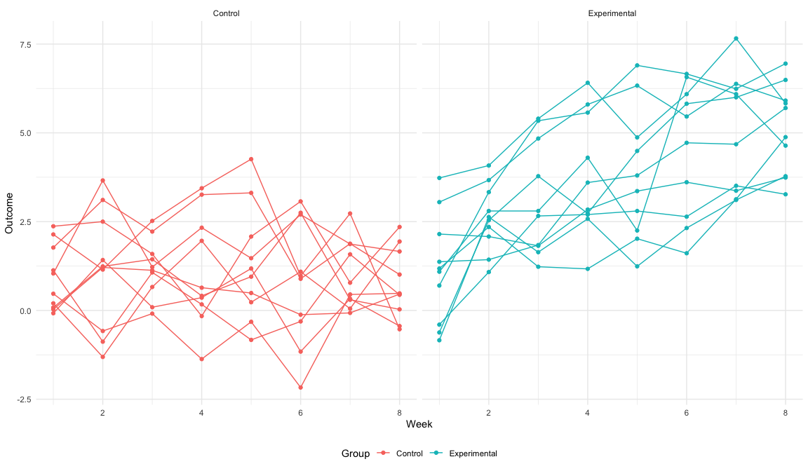
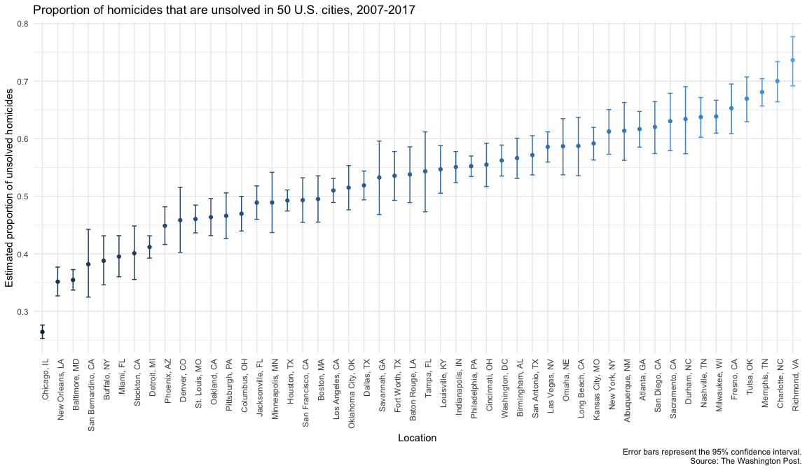
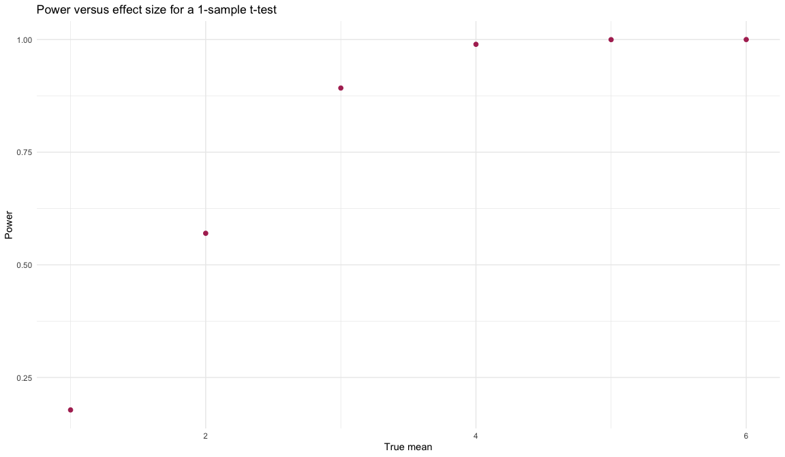
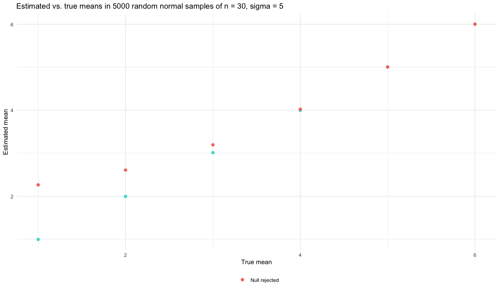

P8105 Homework 3
================
November 16th, 2022

## Part 1: Wrangling longitudinal study data

The `./long_data` folder contains data from a longitudinal study that
included a control arm and an experimental arm. Data for each
participant is included in a separate file, and file names include the
subject ID and arm.

The code chunk below imports the data in individual spreadsheets
contained in `./long_data`. To do this, we create a dataframe that
includes the list of all files in that directory and the complete path
to each file. As a next step, we `map` over paths and import data using
the `read_csv` function. Finally, we can `unnest` the result of `map`.

``` r
full_df = tibble(
  files = list.files("./long_data"),
  path = str_c("./long_data/", files)) %>% 
  mutate(data = map(path, read_csv)) %>% 
  unnest()
```

The result of the previous code chunk isn’t tidy – data are wide rather
than long, and some important variables are included as parts of others.
The code chunk below tides the data using string manipulations on the
file, converting from wide to long, and selecting relevant variables.

``` r
tidy_df = full_df %>% 
  mutate(
    files = str_replace(files, ".csv", ""),
    group = recode(str_sub(files, 1, 3), con = "Control", exp = "Experimental")
    ) %>% 
  pivot_longer(
    week_1:week_8,
    names_to = "week",
    values_to = "outcome",
    names_prefix = "week_") %>% 
  mutate(week = as.numeric(week)) %>% 
  select(group, subj = files, week, outcome)
```

Finally, the code chunk below creates a plot showing individual data,
faceted by group.

``` r
tidy_df %>% 
  ggplot(aes(x = week, y = outcome, group = subj, color = group)) + 
  geom_point() + 
  geom_path() + 
  facet_grid(~group) +
  labs(
    x = "Week", 
    y = "Outcome", 
    color = "Group"
  )
```

<!-- -->

This plot suggests high within-subject correlation – subjects who start
above average end up above average, and those that start below average
end up below average. Subjects in the control group generally don’t
change over time, but those in the experiment group increase their
outcome in a roughly linear way.

## Part 2: U.S. Homicide Rates

### Clean and summarise data

The Washington Post has gathered data on homicides in 50 large U.S.
cities. Let’s load the raw homicide data and inspect it.

``` r
homicide_data = read_csv("data/homicide-data.csv") %>% 
  janitor::clean_names()

homicide_data
```

    ## # A tibble: 52,179 × 12
    ##    uid   repor…¹ victi…² victi…³ victi…⁴ victi…⁵ victi…⁶ city  state   lat   lon
    ##    <chr>   <dbl> <chr>   <chr>   <chr>   <chr>   <chr>   <chr> <chr> <dbl> <dbl>
    ##  1 Alb-…  2.01e7 GARCIA  JUAN    Hispan… 78      Male    Albu… NM     35.1 -107.
    ##  2 Alb-…  2.01e7 MONTOYA CAMERON Hispan… 17      Male    Albu… NM     35.1 -107.
    ##  3 Alb-…  2.01e7 SATTER… VIVIANA White   15      Female  Albu… NM     35.1 -107.
    ##  4 Alb-…  2.01e7 MENDIO… CARLOS  Hispan… 32      Male    Albu… NM     35.1 -107.
    ##  5 Alb-…  2.01e7 MULA    VIVIAN  White   72      Female  Albu… NM     35.1 -107.
    ##  6 Alb-…  2.01e7 BOOK    GERALD… White   91      Female  Albu… NM     35.2 -107.
    ##  7 Alb-…  2.01e7 MALDON… DAVID   Hispan… 52      Male    Albu… NM     35.1 -107.
    ##  8 Alb-…  2.01e7 MALDON… CONNIE  Hispan… 52      Female  Albu… NM     35.1 -107.
    ##  9 Alb-…  2.01e7 MARTIN… GUSTAVO White   56      Male    Albu… NM     35.1 -107.
    ## 10 Alb-…  2.01e7 HERRERA ISRAEL  Hispan… 43      Male    Albu… NM     35.1 -107.
    ## # … with 52,169 more rows, 1 more variable: disposition <chr>, and abbreviated
    ## #   variable names ¹​reported_date, ²​victim_last, ³​victim_first, ⁴​victim_race,
    ## #   ⁵​victim_age, ⁶​victim_sex

There are 52179 observations of 12 variables containing information
about homicides in 50 cities across the US. The data contains the date,
victim information (name, age, sex, race), location (city, state,
latitude, longitude), and status of the case.

Next, let’s tidy the data by creating a `city_state` variable, and
mutating entries that are incorrectly entered (notably, changing Tulsa,
AL to Tulsa, OK). We will group by and summarise the data within cities
to obtain the total number of homicides and the number of unsolved
homicides.

``` r
homicide_summary = homicide_data %>% 
  mutate(
    state = str_to_upper(state),
    state = ifelse(city == "Tulsa" & state == "AL", "OK", state),
    city_state = str_c(city, state, sep = ", "), 
    status = ifelse(
      disposition == "Closed without arrest" | disposition == "Open/No arrest", "Solved", "Unsolved")) %>% 
  group_by(city_state) %>% 
  summarise(n_unsolved = sum(status == "Unsolved"), 
            n_total = n()) 

homicide_summary
```

    ## # A tibble: 50 × 3
    ##    city_state      n_unsolved n_total
    ##    <chr>                <int>   <int>
    ##  1 Albuquerque, NM        232     378
    ##  2 Atlanta, GA            600     973
    ##  3 Baltimore, MD         1002    2827
    ##  4 Baton Rouge, LA        228     424
    ##  5 Birmingham, AL         453     800
    ##  6 Boston, MA             304     614
    ##  7 Buffalo, NY            202     521
    ##  8 Charlotte, NC          481     687
    ##  9 Chicago, IL           1462    5535
    ## 10 Cincinnati, OH         385     694
    ## # … with 40 more rows

### Estimating the proportion of unsolved homicides in Baltimore

Next, for the city of Baltimore, MD, we will use the `prop.test`
function to estimate the proportion of homicides that are unsolved and
its confidence interval.

``` r
baltimore_df = homicide_summary %>% 
  filter(city_state == "Baltimore, MD") 

x = baltimore_df %>% pull(n_unsolved)
n = baltimore_df %>% pull(n_total)
  
baltimore_est = prop.test(x, n) 

baltimore_est %>% 
  broom::tidy() %>% 
  select(estimate, conf.low, conf.high) %>% 
  mutate_all(~ . * 100) %>% 
  mutate(across(everything(), round, 2)) %>% 
  rename("Estimated proportion of unsolved homicides (%)" = estimate,
         "Lower confidence limit" = conf.low, 
         "Upper confidence limit" = conf.high)
```

    ## # A tibble: 1 × 3
    ##   `Estimated proportion of unsolved homicides (%)` Lower confidence li…¹ Upper…²
    ##                                              <dbl>                 <dbl>   <dbl>
    ## 1                                             35.4                  33.7    37.2
    ## # … with abbreviated variable names ¹​`Lower confidence limit`,
    ## #   ²​`Upper confidence limit`

We can see that the estimated proportion of of unsolved homicides in
Baltimore is 35.4439335%. We are 95% confident that the proportion of
unsolved homicides in Baltimore is between 33.684014% and 37.2437542%.

### Estimating the proportion of unsolved homicides across cities

While the code chunk above lets us compute the output for single city,
we may want a more efficient way to get estimates for all cities. We
will therefore use `map2` to apply the `prop.test` function to estimate
the proportion of unsolved homicides in all cities in our dataset.

``` r
unsolved_homicides = homicide_summary %>% 
  mutate(
    prop_test = map2(.x = n_unsolved, .y = n_total, ~prop.test(x = .x, n = .y) %>% 
                       broom::tidy())) %>% 
  unnest(prop_test) %>% 
  select(city_state:estimate, conf.low, conf.high)

unsolved_homicides
```

    ## # A tibble: 50 × 6
    ##    city_state      n_unsolved n_total estimate conf.low conf.high
    ##    <chr>                <int>   <int>    <dbl>    <dbl>     <dbl>
    ##  1 Albuquerque, NM        232     378    0.614    0.562     0.663
    ##  2 Atlanta, GA            600     973    0.617    0.585     0.647
    ##  3 Baltimore, MD         1002    2827    0.354    0.337     0.372
    ##  4 Baton Rouge, LA        228     424    0.538    0.489     0.586
    ##  5 Birmingham, AL         453     800    0.566    0.531     0.601
    ##  6 Boston, MA             304     614    0.495    0.455     0.535
    ##  7 Buffalo, NY            202     521    0.388    0.346     0.431
    ##  8 Charlotte, NC          481     687    0.700    0.664     0.734
    ##  9 Chicago, IL           1462    5535    0.264    0.253     0.276
    ## 10 Cincinnati, OH         385     694    0.555    0.517     0.592
    ## # … with 40 more rows

The resulting `unsolved_homicides` dataframe contains 50 observations of
6 variables, providing number of unsolved and total homicides, and the
estimated proportion of unsolved homicides, along with their 95% CIs
which come from mapping the `prop.test` function to all the cities.

Finally, we will create a plot of the estimated proportions of unsolved
homicides in each city, along with their confidence intervals.

``` r
unsolved_homicides %>% 
  mutate(city_state = fct_reorder(city_state, estimate)) %>% 
  ggplot(aes(x = city_state, y = estimate, colour = estimate)) + 
  geom_point() + 
  geom_errorbar(aes(ymin = conf.low, ymax = conf.high, width = .3)) + 
  theme(axis.text.x = element_text(angle = 90, hjust = 1), 
        legend.position = "none") + 
  labs(
    x = "Location",
    y = "Estimated proportion of unsolved homicides",
    title = "Proportion of homicides that are unsolved in 50 U.S. cities, 2007-2017",
    caption = paste0(
          "Error bars represent the 95% confidence interval.",
          "\nSource: The Washington Post.")
  )
```

<!-- -->

We can see from the above plot that the estimated proportion of unsolved
homicides ranges from \~25% to \~75%. The cities with the lowest
unsolved homicide rates include Chicago and New Orleans, while cities
with the highest unsolved homicide rates include Charlotte and Richmond.

## Part 3: Simulating parameters that affect power

A common question when designing experiments is whether a false null
hypothesis will be rejected, or what the power of a study will be. Power
depends on the sample size of our study, effect size, and error
variance. In this problem, we will conduct a simulation to explore power
in a one-sample t-test.

### Iterating a t-test computation

First, we will write a function that generates a random sample from a
normal distribution and outputs the results for a one-sample t-test of
$H_0: \mu = 0$ for $\alpha = 0.05$ on the sample mean. We will fix the
$n = 30$, $\sigma = 5$, and allow the $\mu$ to vary.

``` r
sim_t_test = function(true_mean) {
  
  sample = rnorm(n = 30, sd = 5, mean = true_mean)
  
  test_results = t.test(sample)
  
  test_results %>% 
    broom::tidy()
}
```

We will map the `sim_t_test` function 5000 times, setting the true
$\mu = 0$, and save the estimated mean and p-value from the t-test
results.

``` r
sim_df = expand_grid(
  true_mean = 0,
  iterate = 1:5000) %>% 
  mutate(ttest_df = map(true_mean, sim_t_test)) %>% 
  unnest(ttest_df) %>% 
  select(true_mean:estimate, p.value)

sim_df
```

    ## # A tibble: 5,000 × 4
    ##    true_mean iterate estimate p.value
    ##        <dbl>   <int>    <dbl>   <dbl>
    ##  1         0       1 -1.50      0.113
    ##  2         0       2  0.874     0.293
    ##  3         0       3 -0.303     0.723
    ##  4         0       4 -0.00765   0.994
    ##  5         0       5  0.930     0.430
    ##  6         0       6 -0.415     0.692
    ##  7         0       7 -0.363     0.654
    ##  8         0       8 -0.0916    0.908
    ##  9         0       9 -0.403     0.657
    ## 10         0      10  0.577     0.490
    ## # … with 4,990 more rows

The resulting dataset has 5000 iterations of estimates for $\hat{\mu}$
generated from a normal distribution and p-values for one-sample t-test
for a true mean of $\mu = 0$. We can see that the $\hat{\mu}$ estimates
hover around 0. For $\hat{\mu}$ estimates that are far from 0, the
corresponding p-value is less than 0.05, indicating a rejection of the
null hypothesis.

### Computing power across varying effect sizes

Now, we want to see how often $H_0$ is rejected when we increase $\mu$.
For this, we will iterate on 5000 random samples of a normal
distribution for $\mu= \{1,2,3,4,5,6\}$. We will also create a
`reject_h0` variable to indicate whether the null hypothesis of
$H_0: \mu = 0$ was rejected based on the `p.value`.

``` r
power_df = expand_grid(
  true_mean = 1:6,
  iterate = 1:5000) %>% 
  mutate(ttest_df = map(true_mean, sim_t_test)) %>% 
  unnest(ttest_df) %>% 
  select(true_mean:estimate, p.value) %>% 
  mutate(reject_h0 = ifelse(p.value < 0.05, "Null rejected", "Null not rejected"))

power_df
```

    ## # A tibble: 30,000 × 5
    ##    true_mean iterate estimate p.value reject_h0        
    ##        <int>   <int>    <dbl>   <dbl> <chr>            
    ##  1         1       1   1.90    0.0170 Null rejected    
    ##  2         1       2  -0.445   0.680  Null not rejected
    ##  3         1       3   1.69    0.0540 Null not rejected
    ##  4         1       4   0.734   0.463  Null not rejected
    ##  5         1       5  -0.155   0.873  Null not rejected
    ##  6         1       6   2.17    0.0459 Null rejected    
    ##  7         1       7   0.650   0.587  Null not rejected
    ##  8         1       8   0.813   0.358  Null not rejected
    ##  9         1       9   0.0733  0.927  Null not rejected
    ## 10         1      10   1.17    0.323  Null not rejected
    ## # … with 29,990 more rows

The resulting dataset has 30000 iterations for true mean values ranging
from 1 to 6, estimating the $\hat{\mu}$ generated from a normal
distribution and p-values for one-sample t-test. We can see that the
$\hat{\mu}$ estimates hover around the true mean value, and for
$\hat{\mu}$ estimates that are far from $\mu$, the corresponding p-value
is less than 0.05.

Let’s plot the proportion of times the null was rejected, also known as
the power of the test according to the true effect size $\mu$.

``` r
summary_power = power_df %>% 
  group_by(true_mean) %>% 
  summarise(prop_reject = sum(reject_h0 == "Null rejected")/n())

summary_power %>% 
  ggplot(aes(x = true_mean, y = prop_reject)) + 
  geom_point(colour = "maroon", size = 2) + 
  labs(
    x = "True mean",
    y = "Power",
    title = "Power versus effect size for a 1-sample t-test"
  )
```

<!-- -->

The above plot shows that as the distance between $\mu$ and $0$
increases (i.e. the effect size), the power (probability of rejecting
the null hypothesis given $H_\alpha: \mu ≠ 0$) increases. For the
largest effect size of $\mu ≠ 6$, the power was 100%.

Finally, we can plot the average estimates of $\hat{\mu}$ against the
true $\mu$, for samples where the null hypothesis was rejected versus
not rejected.

``` r
power_df %>% 
  group_by(true_mean, reject_h0) %>% 
  summarise(mean_est = mean(estimate)) %>% 
  mutate(reject_h0 = fct_relevel(reject_h0, c("Null rejected", "Null not rejected"))) %>% 
  ggplot(aes(x = true_mean, y = mean_est, colour = reject_h0)) + 
  geom_point() + 
  labs(
    x = "True mean",
    y = "Estimated mean",
    title = "Estimated vs. true mean for samples where the null was rejected vs. not rejected", 
    color = ""
  )
```

<!-- -->

Based on the plot, we can see that for samples where the null hypothesis
was rejected, average $\hat{\mu}$ estimates across tests for which the
null is rejected is much lower than true value of $\mu$. This is in
accordance to what we would expect, as samples with an estimated mean
closer to 0 will not reject the null, while samples which were closer to
the true mean value will reject the the null hypothesis.

Moreover, as the effect size ($\mu$) increased, the estimated means
between samples that rejected/did not reject the null deviated further
apart from each other. Notably, for $\mu = 6$, since all samples led to
a rejection of the null hypothesis, there is no $\hat{\mu}$ value,
indicating that the effect size was too large to sample a distribution
which falsely failed to reject the null.
