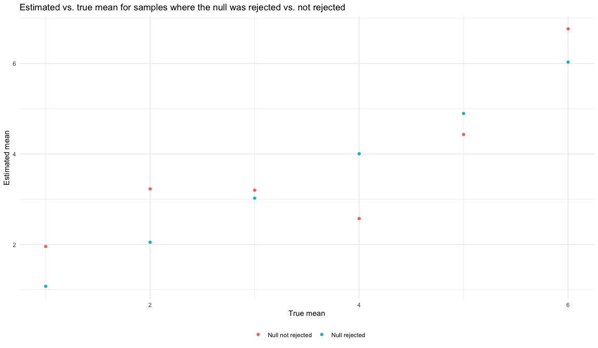

P8105 Homework 3
================
November 16th, 2022

## Part 1:

## Part 2: U.S. Homicide Rates

Let’s load the raw homicide data and inspect it.

``` r
homicide_data = read_csv("data/homicide-data.csv") %>% 
  janitor::clean_names()

homicide_data
```

    ## # A tibble: 52,179 × 12
    ##    uid   repor…¹ victi…² victi…³ victi…⁴ victi…⁵ victi…⁶ city  state   lat   lon
    ##    <chr>   <dbl> <chr>   <chr>   <chr>   <chr>   <chr>   <chr> <chr> <dbl> <dbl>
    ##  1 Alb-…  2.01e7 GARCIA  JUAN    Hispan… 78      Male    Albu… NM     35.1 -107.
    ##  2 Alb-…  2.01e7 MONTOYA CAMERON Hispan… 17      Male    Albu… NM     35.1 -107.
    ##  3 Alb-…  2.01e7 SATTER… VIVIANA White   15      Female  Albu… NM     35.1 -107.
    ##  4 Alb-…  2.01e7 MENDIO… CARLOS  Hispan… 32      Male    Albu… NM     35.1 -107.
    ##  5 Alb-…  2.01e7 MULA    VIVIAN  White   72      Female  Albu… NM     35.1 -107.
    ##  6 Alb-…  2.01e7 BOOK    GERALD… White   91      Female  Albu… NM     35.2 -107.
    ##  7 Alb-…  2.01e7 MALDON… DAVID   Hispan… 52      Male    Albu… NM     35.1 -107.
    ##  8 Alb-…  2.01e7 MALDON… CONNIE  Hispan… 52      Female  Albu… NM     35.1 -107.
    ##  9 Alb-…  2.01e7 MARTIN… GUSTAVO White   56      Male    Albu… NM     35.1 -107.
    ## 10 Alb-…  2.01e7 HERRERA ISRAEL  Hispan… 43      Male    Albu… NM     35.1 -107.
    ## # … with 52,169 more rows, 1 more variable: disposition <chr>, and abbreviated
    ## #   variable names ¹​reported_date, ²​victim_last, ³​victim_first, ⁴​victim_race,
    ## #   ⁵​victim_age, ⁶​victim_sex

There are 52179 observations of 12 variables containing information
about homicides in 50 cities across the US. The data contains the date,
victim information (name, age, sex, race), location (city, state,
latitude, longitude), and status of the case.

Next, let’s tidy the data by creating a city_state variable, and
changing wrongly entered data entries (notably, changing Tulsa, AL to
Tulsa, OK). We will then summarise the data within cities to obtain the
total number of homicides and the number of unsolved homicides.

``` r
homicide_summary = homicide_data %>% 
  mutate(
    state = str_to_upper(state),
    city_state = str_c(city, state, sep = ", "), 
    status = ifelse(
      disposition == "Closed without arrest" | disposition == "Open/No arrest", "Solved", "Unsolved")) %>% 
  group_by(city_state) %>% 
  summarise(n_unsolved = sum(status == "Unsolved"), 
            n_total = n()) 

homicide_summary
```

    ## # A tibble: 51 × 3
    ##    city_state      n_unsolved n_total
    ##    <chr>                <int>   <int>
    ##  1 Albuquerque, NM        232     378
    ##  2 Atlanta, GA            600     973
    ##  3 Baltimore, MD         1002    2827
    ##  4 Baton Rouge, LA        228     424
    ##  5 Birmingham, AL         453     800
    ##  6 Boston, MA             304     614
    ##  7 Buffalo, NY            202     521
    ##  8 Charlotte, NC          481     687
    ##  9 Chicago, IL           1462    5535
    ## 10 Cincinnati, OH         385     694
    ## # … with 41 more rows

Next, for the city of Baltimore, MD, we will use the `prop.test`
function to estimate the proportion of homicides that are unsolved and
its confidence interval.

``` r
baltimore_df = homicide_summary %>% 
  filter(city_state == "Baltimore, MD") 

x = baltimore_df %>% pull(n_unsolved)
n = baltimore_df %>% pull(n_total)
  
baltimore_est = prop.test(x, n) 

baltimore_est %>% 
  broom::tidy() %>% 
  select(estimate, conf.low, conf.high) %>% 
  mutate_all(~ . * 100) %>% 
  rename("Estimated proportion of unsolved homicides" = estimate,
         "Lower confidence limit" = conf.low, 
         "Upper confidence limit" = conf.high)
```

    ## # A tibble: 1 × 3
    ##   `Estimated proportion of unsolved homicides` `Lower confidence limit` Upper …¹
    ##                                          <dbl>                    <dbl>    <dbl>
    ## 1                                         35.4                     33.7     37.2
    ## # … with abbreviated variable name ¹​`Upper confidence limit`

We can see that the estimated proportion of of unsolved homicides in
Baltimore is 35.4439335%. We are 95% confident that the proportion of
unsolved homicides in Baltimore is between 33.684014% and 37.2437542%.

Next, we want use `map` to apply the `prop.test` function to estimate
the proportion of unsolved homicides in all cities in our dataset.

``` r
unsolved_homicides = homicide_summary %>% 
  mutate(
    prop_test = map2(.x = n_unsolved, .y = n_total, ~prop.test(x = .x, n = .y) %>% 
                       broom::tidy())) %>% 
  unnest(prop_test) %>% 
  select(city_state:estimate, conf.low, conf.high)

unsolved_homicides
```

    ## # A tibble: 51 × 6
    ##    city_state      n_unsolved n_total estimate conf.low conf.high
    ##    <chr>                <int>   <int>    <dbl>    <dbl>     <dbl>
    ##  1 Albuquerque, NM        232     378    0.614    0.562     0.663
    ##  2 Atlanta, GA            600     973    0.617    0.585     0.647
    ##  3 Baltimore, MD         1002    2827    0.354    0.337     0.372
    ##  4 Baton Rouge, LA        228     424    0.538    0.489     0.586
    ##  5 Birmingham, AL         453     800    0.566    0.531     0.601
    ##  6 Boston, MA             304     614    0.495    0.455     0.535
    ##  7 Buffalo, NY            202     521    0.388    0.346     0.431
    ##  8 Charlotte, NC          481     687    0.700    0.664     0.734
    ##  9 Chicago, IL           1462    5535    0.264    0.253     0.276
    ## 10 Cincinnati, OH         385     694    0.555    0.517     0.592
    ## # … with 41 more rows

The resulting `unsolved_homicides` dataframe contains 51 observations of
6 variables, providing number of unsolved and total homicides, and the
estimated proportion of unsolved homicides, along with their 95% CIs
which come from mapping the `prop.test` function to all the cities.

Finally, we will create a plot of the estimated proportions of unsolved
homicides in each city, along with their confidence intervals.

``` r
unsolved_homicides %>% 
  mutate(city_state = fct_reorder(city_state, estimate)) %>% 
  ggplot(aes(x = city_state, y = estimate, colour = estimate)) + 
  geom_point() + 
  geom_errorbar(aes(ymin = conf.low, ymax = conf.high, width = .3)) + 
  theme(axis.text.x = element_text(angle = 90, hjust = 1), 
        legend.position = "none") + 
  labs(
    x = "Location",
    y = "Estimated proportion of unsolved homicides",
    title = "Proportion of homicides that are unsolved in 50 U.S. cities, 2007-2017",
  )
```

<!-- -->

## Part 3: Simulating parameters that affect power

A common question when designing experiments is whether a false null
hypothesis will be rejected, or what the power of a study will be. Power
depends on the sample size of our study, effect size, and error
variance. In this problem, we will conduct a simulation to explore power
in a one-sample t-test.

First, we will write a function that generates a random sample from a
normal distribution and outputs the results for a one-sample t-test of
$H_0: \mu = 0$ for $\alpha = 0.05$ on the sample mean. We will fix the
$n = 30$, $\sigma = 5$, and allow the $\mu$ to vary.

``` r
sim_t_test = function(true_mean) {
  
  sample = rnorm(n = 30, sd = 5, mean = true_mean)
  
  test_results = t.test(sample, mu = true_mean)
  
  test_results %>% 
    broom::tidy()
}
```

We will map the `sim_t_test` function 5000 times, setting the true
$\mu = 0$, and saving the estimated mean and p-value from the t-test
results.

``` r
sim_df = expand_grid(
  true_mean = 0,
  iterate = 1:100) %>% 
  mutate(ttest_df = map(true_mean, sim_t_test)) %>% 
  unnest(ttest_df) %>% 
  select(true_mean:estimate, p.value)

sim_df
```

    ## # A tibble: 100 × 4
    ##    true_mean iterate estimate p.value
    ##        <dbl>   <int>    <dbl>   <dbl>
    ##  1         0       1  -0.304  0.698  
    ##  2         0       2  -1.51   0.0761 
    ##  3         0       3   2.18   0.0278 
    ##  4         0       4   0.123  0.885  
    ##  5         0       5  -0.349  0.649  
    ##  6         0       6  -0.209  0.803  
    ##  7         0       7   2.93   0.00358
    ##  8         0       8  -0.0882 0.932  
    ##  9         0       9   0.582  0.546  
    ## 10         0      10   1.62   0.0848 
    ## # … with 90 more rows

The resulting dataset has 100 iterations of estimates for $\hat{\mu}$
generated from a normal distribution and p-values for one-sample t-test
for a true mean of $\mu = 0$. We can see that the $\hat{\mu}$ estimates
hover around 0. For $\hat{\mu}$ estimates that are far from 0, the
corresponding p-value is less than 0.05, indicating a rejection of the
null hypothesis.

Now, we want to see how often $H_0$ is rejected when we increase $\mu$.
For this, we will iterate on 5000 random samples of a normal
distribution for $\mu= \{1,2,3,4,5,6\}$. We will also create a
`reject_h0` variable to indicate whether the null hypothesis of
$H_0: \mu = true mean$ was rejected based on the `p.value`.

``` r
power_df = expand_grid(
  true_mean = 1:6,
  iterate = 1:100) %>% 
  mutate(ttest_df = map(true_mean, sim_t_test)) %>% 
  unnest(ttest_df) %>% 
  select(true_mean:estimate, p.value) %>% 
  mutate(reject_h0 = ifelse(p.value < 0.05, "Null rejected", "Null not rejected"))

power_df
```

    ## # A tibble: 600 × 5
    ##    true_mean iterate estimate p.value reject_h0        
    ##        <int>   <int>    <dbl>   <dbl> <chr>            
    ##  1         1       1    0.583   0.675 Null not rejected
    ##  2         1       2    1.53    0.507 Null not rejected
    ##  3         1       3    1.44    0.610 Null not rejected
    ##  4         1       4    2.19    0.183 Null not rejected
    ##  5         1       5    1.31    0.693 Null not rejected
    ##  6         1       6    1.83    0.382 Null not rejected
    ##  7         1       7    0.444   0.535 Null not rejected
    ##  8         1       8    0.500   0.655 Null not rejected
    ##  9         1       9   -0.164   0.212 Null not rejected
    ## 10         1      10   -0.168   0.227 Null not rejected
    ## # … with 590 more rows

The resulting dataset has 600 iterations for true mean values ranging
from 1 to 6, estimating the $\hat{\mu}$ generated from a normal
distribution and p-values for one-sample t-test. We can see that the
$\hat{\mu}$ estimates hover around the true mean value, and for
$\hat{\mu}$ estimates that are far from $\mu$, the corresponding p-value
is less than 0.05.

Let’s plot the proportion of times the null was rejected, also known as
the power of the test according to the true effect size $\mu$.

``` r
summary_power = power_df %>% 
  group_by(true_mean) %>% 
  summarise(prop_reject = sum(reject_h0 == "Null rejected")/n())

summary_power %>% 
  ggplot(aes(x = true_mean, y = prop_reject)) + 
  geom_point(colour = "purple") + 
  labs(
    x = "True mean",
    y = "Power",
    title = "Power versus effect size for a 1-sample t-test"
  )
```

<!-- -->

Notably, we see that as the effect size $\mu$ increases, the power
increases.

Finally, we can plot the average estimates of $\hat{\mu}$ against the
true $\mu$, for samples where the null hypothesis was rejected versus
not rejected.

``` r
power_df %>% 
  group_by(true_mean, reject_h0) %>% 
  summarise(mean_est = mean(estimate, na.rm = TRUE)) %>% 
  mutate(reject_h0 = fct_relevel(c("Null rejected", "Null not rejected"))) %>% 
  ggplot(aes(x = true_mean, y = mean_est, colour = reject_h0)) + 
  geom_point() + 
  labs(
    x = "True mean",
    y = "Estimated mean",
    title = "Estimated vs. true mean for samples where the null was rejected vs. not rejected", 
    color = ""
  )
```

<!-- -->

Based on the plot, we can see that for samples where the null hypothesis
was rejected, average $\hat{\mu}$̂ estimates across tests for which the
null is rejected is much lower than the true value of $\mu$. This is in
accordance to what we would expect, as estimated means which deviate
substantially from the true mean will lead to a rejection of the null
hypothesis.
